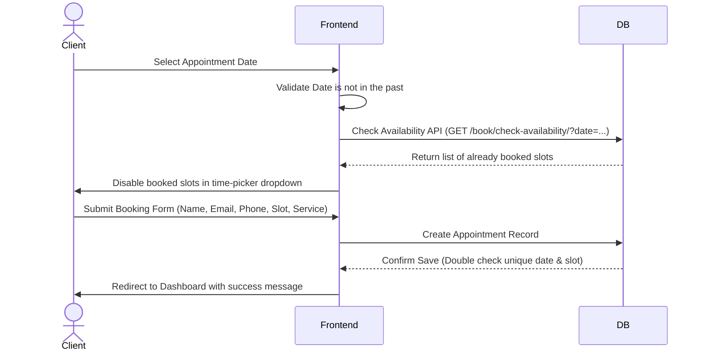

# 📖 HairGlow Scheduler & Shop — User Stories & Use Cases

This document outlines the comprehensive user stories, customer journeys, and acceptance criteria for **HairGlow Scheduler & Shop**. It serves as a guide to understanding how clients interact with the platform.

---

## 👥 User Personas

### Persona 1: Clara (The Client)
*   **Background:** Busy corporate consultant who values convenience, premium hair care products, and reliable booking systems.
*   **Goals:** 
    *   Schedule hair consultations that fit her tight calendar without calling the salon.
    *   Purchase high-end hair oils and masks recommended by her stylist.
    *   Track her appointment history and order receipts in one place.

### Persona 2: Salon Admin / Stylist (Staff Persona)
*   **Background:** Operational lead managing salon schedules and product stocks.
*   **Goals:**
    *   Ensure double-bookings are impossible to prevent customer frustration.
    *   Keep accurate track of product stock levels automatically as orders are placed.

---

## 🗺️ Customer Journeys & Stories

### 1. Account Creation & Security
> **As a new customer (Clara)**  
> **I want to** register an account and securely log in  
> **So that** my personal bookings and shopping cart order history are saved.

#### 🛠️ Acceptance Criteria:
*   **Registration:** 
    *   The client must provide a unique username and password.
    *   Validation errors (e.g., weak password, username already taken) must display helpful alert prompts immediately.
    *   Successful registration automatically logs the user in and redirects them to the Home Page with a success toast.
*   **Authentication:**
    *   Registered clients can log in with their credentials.
    *   Invalid login attempts trigger a warning message.
    *   Authenticated users cannot access the `/login/` or `/register/` paths and are redirected to the homepage.
    *   Clients can log out securely, clearing their authentication session.

---

### 2. The Appointment Booking Experience
> **As an authenticated client**  
> **I want to** schedule a hair service for a specific date and time slot  
> **So that** my appointment is reserved and double-bookings are avoided.

#### 🛠️ Acceptance Criteria:
*   **Past Date Prevention:** Users are prevented from choosing booking dates before today's date. The date field enforces the current date as the minimum selectable date (`min_date`).
*   **Real-time Availability check:** When a date is selected, an asynchronous GET request checks `/book/check-availability/`. Any slot already reserved on that day is flagged as unavailable.
*   **Double-booking Block:** Even if two clients open the booking page at the same time for the same slot, the database enforces database integrity via a `unique_together` constraint on `(date, time_slot)`. The second submit will be blocked, and the client will be redirected back to the booking page with a warning.
*   **Default Status:** New appointments are saved with a status of `Pending`.
*   **Cancellation Rules:** From the dashboard, clients can cancel an appointment if its status is `Pending`. Once cancelled, the status changes to `Cancelled`, freeing up that time slot for other users immediately.

---

### 3. Browsing & Shopping Cart Management
> **As a website visitor**  
> **I want to** search and browse hair care products and manage items in a shopping cart  
> **So that** I can review items before checking out.

#### 🛠️ Acceptance Criteria:
*   **Product Search:** Users can filter the product listing using a search bar. The search scans both the product name and descriptions.
*   **Adding to Cart:** 
    *   Users can specify the desired quantity on the product page and add the item.
    *   The cart counter in the global navigation bar updates instantly.
*   **Cart Customization:**
    *   Users can increase or decrease item quantities directly within the cart table.
    *   Users can delete items from the cart.
*   **Stock Validation:** Users cannot add or change item quantities to a value higher than the product's available stock. A warning message informs the user of the maximum limit if exceeded.

---

### 4. Checkout & Inventory Management
> **As a logged-in client**  
> **I want to** check out my shopping cart by providing delivery details  
> **So that** my order is placed and the products are reserved for delivery.

#### 🛠️ Acceptance Criteria:
*   **Login Requirement:** Guest users attempting to access `/checkout/` are redirected to the login page first.
*   **Cart Check:** Empty carts are blocked from checking out, redirecting users back to the shop catalog.
*   **Stock Verification:** The checkout view validates current database stock quantities right before creating the order to ensure items did not go out of stock during the checkout process.
*   **Order Creation:**
    *   On successful form submission, an `Order` record is saved, and each cart item is converted to an `OrderItem` entry.
    *   Product stocks are decremented by the purchased quantities.
    *   If a product's stock drops to `0`, its `is_available` flag is automatically toggled to `False` so it no longer appears in the shop.
*   **Receipt Page:** The checkout redirects to an `Order Success` page showing the unique Order ID, delivery address, ordered items, and order total.

---

### 5. Client Dashboard Hub
> **As an active client**  
> **I want to** view a summary of my account activity  
> **So that** I can keep track of all my scheduled salon services and orders.

#### 🛠️ Acceptance Criteria:
*   **Access Control:** The dashboard is login-protected.
*   **Appointments Panel:** Lists all appointments scheduled by the user (sorted by date and time slot), showing status (`Pending`, `Confirmed`, `Cancelled`), with cancellation buttons next to pending appointments.
*   **Orders Panel:** Lists all placed orders with details including the date, total price, shipping address, and fulfillment status (`Pending`, `Shipped`, `Delivered`, `Cancelled`).
